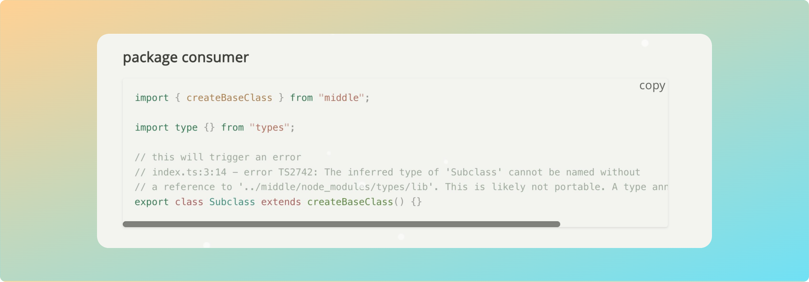

## 起步

代码高亮样式，将 [Shiki][1] 制作为 Typecho 插件形式。

## 使用方法

第一步：下载本插件，放在 `usr/plugins/` 目录中；

第二步：文件夹名改为 ShikiHighlighter；

第三步：登录管理后台，激活插件；

可以在后台设置 Shiki 所有的高亮样式

实际效果：

github开源地址：[ShikiHighlighter_for_Typecho][2]

## 与我联系：

作者：[未央花][3]
或者通过 mail: emt934841028@gmail.com
有任何问题也可评论留言

## 感谢
代码行显示支持:

[Shiki 式][1]

[1]: https://shiki.style/
[2]: https://github.com/Emt-lin/ShikiHighlighter
[3]: https://www.pslanys.com/
